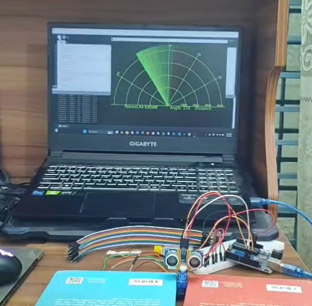

# SONAR project with Arduino & Python
---
- ### Project Purpose: 
To implement a real life electronic engineering application to solve a problem like high altitude object detection using sound wave.

- ### What is a *SONAR*? 
SONAR stands for Sound Navigation And Ranging. It is a technique that uses sound propagation (usually underwater) to:
  1. Navigate: Help submarines or underwater  vehicles determine their position.
  2. Measure Distance: Determine the distance to an  object by calculating the time it takes for a  sound pulse to travel to the object and back.
  3. Detect Objects: Identify the presence of  obstacles or other objects using reflected sound  waves.
  4. Map Surfaces: Create images or maps of the  seafloor or other underwater terrains.
--- 
- ### Source Code:
1. [Arduino Code](/SONAR/SONAR.ino)
2. [Processing Code](/SONAR/Processing/SONAR.pyde)

- ### Compoent List: 
| Serial | Tool Name | Quantity |
|--------|-----------|----------|
|    1   |Arduino Uno|     1    | 
|    2   |Arduino Cable|     1  | 
|    3   |PC/Laptop|     1    | 
|    4   |Breadboard|     1    | 
|    5   |Ultrasonic Sensor|     1    | 
|    6   |Servo Motor|     1    | 
|    7   |Jumper Wires|     As Required    | 

 
